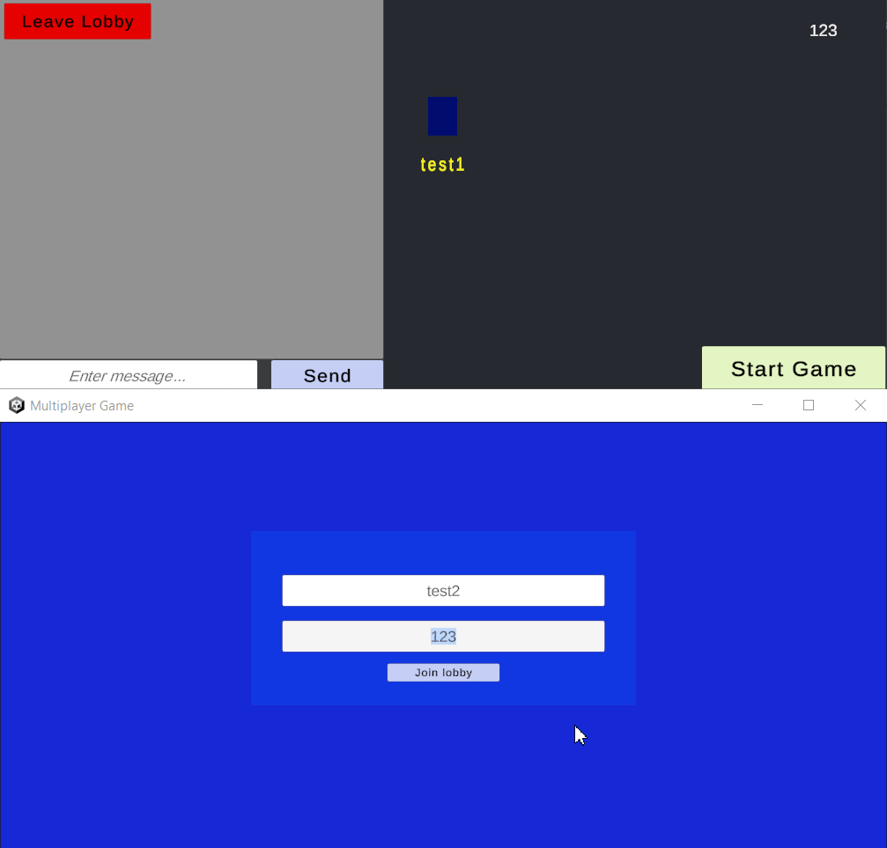

## Multiplayer Tag Game 

Real-time multiplayer game prototype built with:
- Golang WebSocket server
- Unity client

### Features
- WebSocket-based real-time communication
- Client side prediction/Server reconciliation
- Supports 2–8 players per lobby

---

## Download Game Client

Download the latest Unity game build from the [Releases](https://github.com/MisterDodik/MultiplayerTagGame/releases) page.

## Run Backend Server (Docker)

### Requirements
- [Docker](https://www.docker.com/)

  
Build Docker image:

```bash
docker build -t multiplayer-server .
docker run -p 8080:8080 multiplayer-server
```

### How to Play
1. Launch the Unity client
3. Enter a username and lobby seed
4. Click **Join Lobby**

### Controls
- **WASD** – Move
- **Space** – Infect nearby players (when infected)

### Gameplay
Players start as either infected or non-infected.
- Non-infected players' goal is to survive as long as possible
- Infected players have to chase and infect other players

### 🎬 Demo / GIF


